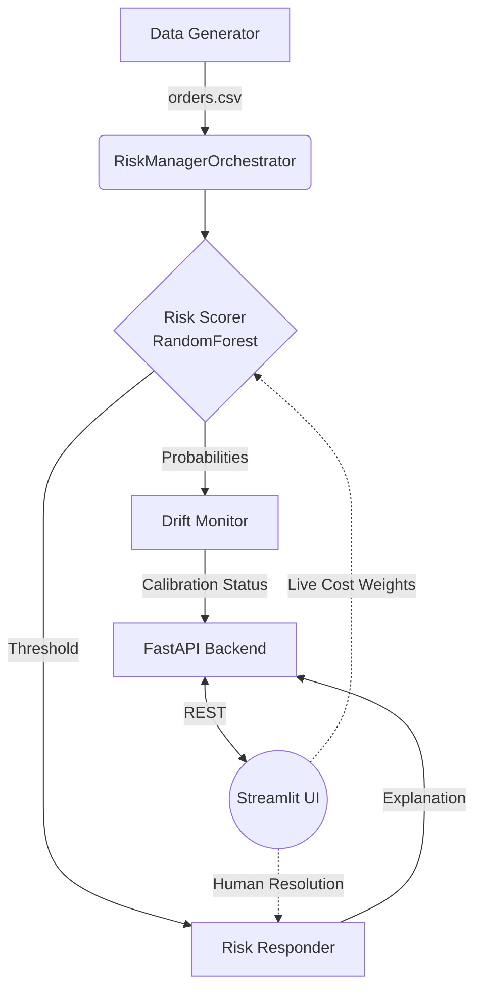

# AI Risk Manager 🛡️

A complete, end-to-end Machine Learning pipeline that predicts return-risk for e-commerce orders. Built for the **Razorpay AI Buildathon 2026 (Track 02: AI Risk Manager)**.

Unlike typical ML projects that stop at accuracy, this project focuses on **Business Cost, Explainability, and Operational Health**. It demonstrates how to deploy an AI system that a human review team can actually trust and an engineering team can actually maintain.

## 🌟 Key Features

1. **Synthetic but Realistic Data**: Generates orders with hidden traits (like `is_bracketer` and `is_high_risk_geo_hopper`) that bleed into observable features (like `variants_in_order` and `delivery_address_change_count`).
2. **Cost-Aware Optimization**: A Live Cost Simulator evaluates the model not on F1 score, but on the net INR saved based on dynamic False Positive (customer insult) and False Negative (return shipping) costs.
3. **Contextual Explainability**: The human review queue doesn't just say "price is important". It says *"price is ₹4,788 (near the 59th percentile)"*, putting the model's logic into immediate human context.
4. **Actionable Drift Monitoring**: Detects when the model degrades and automatically performs root-cause analysis by comparing feature distributions of miscalibrated buckets against a healthy baseline.

---

## 🏗️ System Architecture



---

## 📊 The Real Numbers

Here is the performance of the system based on a fresh 5,000-order generation and cross-validation run:

- **Model Performance (ROC-AUC)**: `0.702` (5-Fold CV: `0.709 ± 0.033`)
- **Cost Savings at Optimal Threshold (0.3)**: Saves **₹52,170** (compared to a "do nothing" baseline of ₹69,120) with FP cost at ₹15 and FN cost at ₹180.
- **The "Bracketing" Effect Size**: Customers buying 1 variant returned 29.4% of the time, while those buying 3 variants returned **84.4%** of the time.
- **The "Geo-Hopper" Effect Size**: Customers with 0 address changes returned 29.8% of the time, jumping to **51.9%** for those with 2+ changes.

---

## 🛠️ What Broke & How I Fixed It

Building a robust pipeline surface several challenges. Here are the top 3 hurdles and solutions:

1. **The Geo-Hopper Signal Was Invisible (Milestone 2)**
   * **What broke:** I added a `delivery_address_change_count` feature to catch fraudulent address hoppers. But after training, it didn't even appear in the top 10 feature importances!
   * **The fix:** I realized the hidden trait `is_high_risk_geo_hopper` was too rare (only 5% of customers) and wasn't strongly linked to the outcome. I tuned the data generator to ensure a stronger correlation between the hidden trait and the actual return probability, making it a viable signal for the Random Forest without overpowering the dataset.
   
2. **Explanations Were Useless to Humans (Milestone 4)**
   * **What broke:** Initially, the system explained decisions by printing global feature importances (e.g., "Account age is important"). Reviewers couldn't tell if *this specific order's* account age was unusually high or low.
   * **The fix:** I injected `scipy.stats.percentileofscore` into the pipeline. Now, the system evaluates the order's value against the entire training distribution, outputting: *"customer_account_age_days = 35 (this is in the bottom 5% of all customers — unusually low)"*.

3. **Cost Simulation Required Expensive Retraining (Milestone 6)**
   * **What broke:** When building the UI slider for the Cost Simulator, recalculating net savings was taking too long if I retrained the model or re-ran the entire batch loop.
   * **The fix:** I decoupled the probability prediction (`predict_proba`) from the threshold evaluation. The API caches the raw test set probabilities, allowing the Streamlit slider to instantly apply new threshold cuts across thousands of orders in milliseconds.

---

## 🚀 What I'd Build Next

If I had another week to build, I would add:
- **Chargeback Evidence Engine**: A third tier for the `RiskResponder` that automatically formats the `explain_action()` output into a PDF evidence packet for Stripe/Razorpay if an order results in a dispute.
- **Automated Retraining Pipeline**: Hook the `drift_monitor`'s recommendation directly into an Airflow DAG. If drift is detected and it's been >90 days, it automatically pulls the last 30 days of data, retrains, and pushes the new model to a staging endpoint.

---

## 💻 Local Setup Guide

Follow these steps to run the complete system (Backend API + Frontend UI) on your local machine.

### 1. Prerequisites
- Python 3.10 or higher.
- Git.

### 2. Install Dependencies
Clone the repository and install the required packages:
```bash
git clone https://github.com/23f3002112/AI_risk_manager.git
cd AI_risk_manager
pip install -r requirements.txt
```

### 3. Generate Data & Train Model
The backend uses a synthetic dataset. Generate it and train the model before starting the API:
```bash
cd data
python generate_orders.py --n 5000 --seed 42
cd ../backend
python risk_scorer.py
cd ..
```

### 4. Start the Backend (FastAPI)
Open a terminal and start the backend server:
```bash
python -m uvicorn backend.api:app --reload --port 8000
```

### 5. Start the Dashboard (Streamlit)
Open a *new, separate terminal*, ensure you are in the project root, and run:
```bash
python -m streamlit run frontend/app.py --server.port 8501
```
Your browser will automatically open the dashboard at `http://localhost:8501`.


